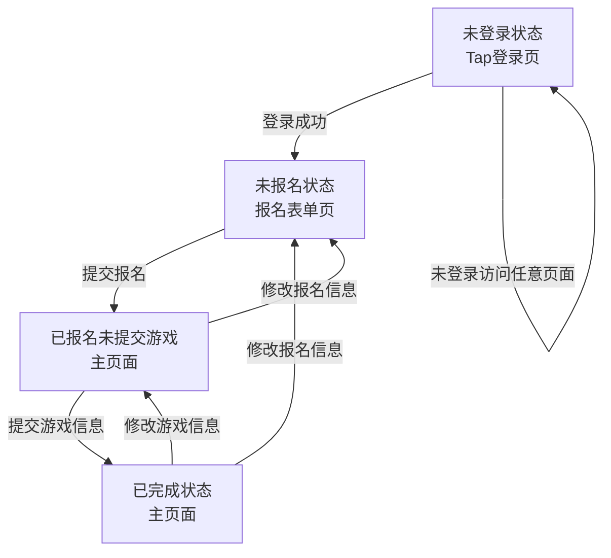
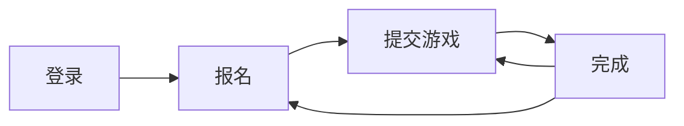
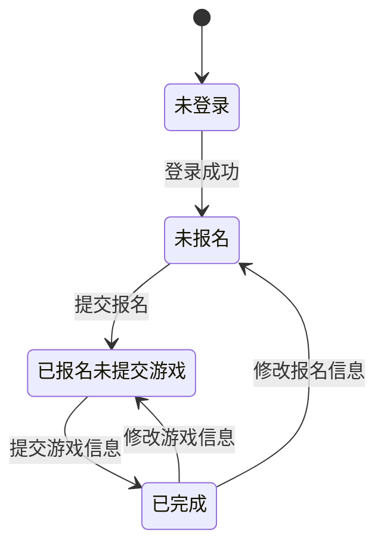
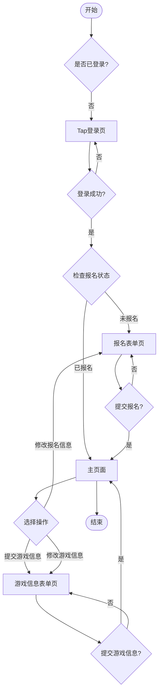

# GameJam报名系统流程图

## 1. 页面流转流程图

### Mermaid格式

### 简化版本

## 2. 状态转换图

## 3. 用户操作流程图

## 4. 文字版流程说明

### 主要流程
1. **未登录状态** → 用户访问任意页面都会跳转到Tap登录页
2. **登录成功** → 根据用户状态跳转：
   - 未报名用户 → 进入报名表单页
   - 已报名用户 → 进入主页面
3. **报名表单页** → 填写基本信息后提交 → 进入主页面（已报名未提交游戏状态）
4. **主页面** → 根据当前状态显示不同操作：
   - 已报名未提交游戏：显示"提交游戏信息"按钮
   - 已完成：显示"修改报名信息"和"修改游戏信息"按钮
5. **游戏信息表单页** → 填写游戏信息后提交 → 返回主页面（已完成状态）

### 状态转换规则
- 未登录 → 登录成功 → 根据报名状态跳转
- 未报名 → 提交报名 → 已报名未提交游戏
- 已报名未提交游戏 → 提交游戏信息 → 已完成
- 已完成 → 修改报名信息 → 未报名状态
- 已完成 → 修改游戏信息 → 已报名未提交游戏状态

### 页面访问权限
- **登录页**：所有未登录用户可访问
- **报名表单页**：已登录用户可访问
- **主页面**：已报名用户可访问
- **游戏信息表单页**：已报名用户可访问

### 数据验证规则
- 手机号：1[3-9]xxxxxxxxx格式
- 游戏ID：必须是用户管理的游戏
- 团队人数：1-50的整数
- 主题描述：100字以内 