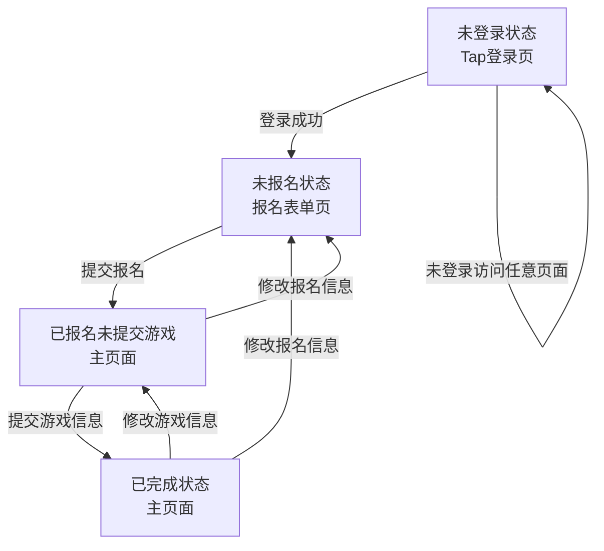

# GameJam报名系统 - 运营需求文档

## 1. 业务目标

### 核心目标
- 提高报名转化率：从传统表单的30%提升到60%
- 减少人工审核工作量：自动化验证，减少80%人工操作
- 提升数据质量：确保100%必填字段完整性

### 关键指标
- 报名完成率 > 60%
- 游戏信息提交率 > 80%
- 用户反馈满意度 > 4.5/5

## 2. 用户流程

### 2.1 报名流程
```
登录 → 填写基本信息 → 提交报名 → 补充游戏信息 → 完成
```

### 2.2 状态管理
- **未报名**：引导填写报名信息
- **已报名未提交游戏**：提醒提交游戏信息
- **已完成**：显示参与状态

## 3. 功能需求

### 3.1 必填字段
**报名信息**：
- Tap ID（自动获取）
- 手机号（格式验证）
- 微信号（最少6位）
- 团队人数（1-50人）

**游戏信息**：
- 游戏ID（权限验证）
- 上线形式（四选一）
- 应征主题（六选一）
- 主题描述（100字内）

### 3.2 验证规则
- 手机号：1[3-9]xxxxxxxxx格式
- 游戏ID：必须是用户管理的游戏
- 团队人数：1-50的整数

### 3.3 业务规则
- 支持先报名后补交游戏信息
- 只有游戏管理员才能提交特定游戏
- 允许修改已提交的信息

---

## 4. 页面逻辑与流转规则

### 4.1 页面结构与状态流转

**页面流转流程图：**



**文字版流程说明：**

1. **未登录状态** → 用户访问任意页面都会跳转到Tap登录页
2. **登录成功** → 根据用户状态跳转：
   - 未报名用户 → 进入报名表单页
   - 已报名用户 → 进入主页面
3. **报名表单页** → 填写基本信息后提交 → 进入主页面（已报名未提交游戏状态）
4. **主页面** → 根据当前状态显示不同操作：
   - 已报名未提交游戏：显示"提交游戏信息"按钮
   - 已完成：显示"修改报名信息"和"修改游戏信息"按钮
5. **游戏信息表单页** → 填写游戏信息后提交 → 返回主页面（已完成状态）

**状态转换规则：**
- 未登录 → 登录成功 → 根据报名状态跳转
- 未报名 → 提交报名 → 已报名未提交游戏
- 已报名未提交游戏 → 提交游戏信息 → 已完成
- 已完成 → 修改报名信息 → 未报名状态
- 已完成 → 修改游戏信息 → 已报名未提交游戏状态

### 4.2 页面说明与跳转规则

#### 登录页（TapLogin）
- 入口：未登录用户访问任意页面都会跳转到此页
- 操作：点击"使用Tap账号登录"按钮
- 跳转：登录成功后自动跳转到"报名表单页"或"主页面"，根据用户状态判断
- 限制：未登录用户无法访问其他页面

#### 报名表单页（SignupForm）
- 入口：
  - 登录后且未报名时自动进入
  - 已报名用户点击"修改报名信息"进入
- 操作：填写并提交报名信息（Tap ID自动填充，手机号、微信号、团队人数必填）
- 跳转：提交成功后跳转到"主页面"（已报名未提交游戏状态）
- 限制：
  - 已报名用户不可重复提交报名（只能修改）
  - 未登录用户无法访问

#### 主页面（Home）
- 入口：
  - 已报名用户登录后自动进入
  - 报名表单页提交成功后进入
- 内容：
  - 显示当前报名进度（进度条/状态卡片）
  - 根据状态显示不同操作按钮
    - "提交游戏信息"按钮（已报名未提交游戏时）
    - "修改报名信息"按钮
    - "修改游戏信息"按钮（已完成时）
- 跳转：
  - 点击"提交游戏信息"进入"游戏信息表单页"
  - 点击"修改报名信息"进入"报名表单页"
  - 点击"修改游戏信息"进入"游戏信息表单页"
- 限制：
  - 未报名用户无法访问
  - 未登录用户无法访问

#### 游戏信息表单页（GameForm）
- 入口：主页面点击"提交游戏信息"或"修改游戏信息"进入
- 操作：填写并提交游戏信息（游戏ID需验证，上线形式、应征主题、主题描述必填）
- 跳转：提交成功后返回"主页面"（已完成状态）
- 限制：
  - 只有已报名用户可访问
  - 游戏ID必须验证通过
  - 未登录用户无法访问

### 4.3 状态与页面关系一览表

| 用户状态                | 默认页面         | 可操作页面         | 允许操作                | 跳转规则说明                  |
|------------------------|----------------|-------------------|------------------------|-------------------------------|
| 未登录                 | 登录页         | 登录页            | 登录                   | 登录后根据状态跳转            |
| 未报名                 | 报名表单页     | 报名表单页        | 填写并提交报名         | 提交后进入主页面              |
| 已报名未提交游戏       | 主页面         | 主页面/报名表单页/游戏表单页 | 提交游戏信息/修改报名信息 | 提交游戏后进入主页面（已完成）|
| 已完成（已提交游戏信息）| 主页面         | 主页面/报名表单页/游戏表单页 | 修改报名/修改游戏信息      | 修改后回到主页面              |

### 4.4 其他规则
- 所有页面均需登录态校验，未登录自动跳转登录页
- 所有表单均需前端校验，不通过不可提交
- 每次操作后刷新用户状态，确保页面跳转和按钮状态实时更新
- 页面刷新/回退时根据当前用户状态自动跳转到正确页面

---

## 5. 运营需求

### 5.1 数据收集
- 实时报名数据统计
- 用户行为路径分析
- 转化率漏斗分析

### 5.2 用户引导
- 清晰的状态提示
- 分步骤操作指引
- 错误信息友好提示

### 5.3 管理需求
- 报名数据导出
- 用户状态查询
- 游戏信息审核

## 6. 技术要求

### 6.1 性能要求
- 页面加载 < 2秒
- 表单提交 < 3秒
- 支持1000+并发用户

### 6.2 兼容性
- 支持主流浏览器
- 移动端适配
- 响应式设计

### 6.3 安全性
- Tap OAuth认证
- 数据传输加密
- 权限验证

## 7. 验收标准

### 7.1 功能验收
- [ ] 用户能完成完整报名流程
- [ ] 游戏ID验证正常工作
- [ ] 状态提示准确显示
- [ ] 数据正确保存

### 7.2 体验验收
- [ ] 操作流程顺畅
- [ ] 错误提示清晰
- [ ] 移动端体验良好
- [ ] 加载速度满足要求

### 7.3 数据验收
- [ ] 报名数据完整
- [ ] 统计功能正常
- [ ] 导出功能可用

## 8. 上线计划

### 8.1 开发阶段
- 第1周：基础框架搭建
- 第2周：核心功能开发
- 第3周：测试和优化
- 第4周：上线准备

### 8.2 测试阶段
- 内部测试：功能验证
- 用户测试：体验优化
- 压力测试：性能验证

### 8.3 上线阶段
- 灰度发布：10%用户
- 全量发布：所有用户
- 监控优化：持续改进

## 9. 风险控制

### 9.1 技术风险
- 第三方API依赖风险
- 数据安全风险
- 性能瓶颈风险

### 9.2 业务风险
- 用户接受度风险
- 数据质量风险
- 运营效率风险

### 9.3 应对措施
- 备用方案准备
- 数据备份机制
- 监控告警系统 